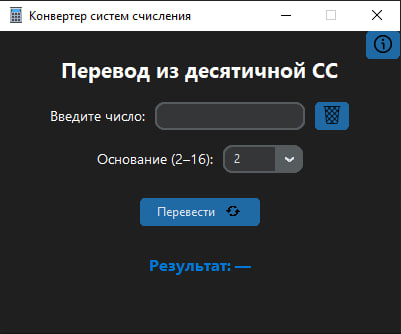

<p align="center">
  <b>🌐 Choose Language / Выберите язык</b><br><br>
  <a href="README_RU.md"></a> |
  <a href="README_EN.md"></a> 
</p>

🌐 Language / Язык

----
# 🔢 Конвертер систем счисления (Decimal Base Converter)

Простое и стильное приложение на **Python (Tkinter + CustomTkinter)**, позволяющее переводить числа из **десятичной системы счисления** в любую другую — от **2 до 16**.  
Интерфейс оформлен в современном тёмном стиле с иконками и плавными элементами.

---

## 🖥️ Возможности

✅ Перевод из **десятичной системы** в любую систему от **2 до 16**  
✅ Удобный графический интерфейс на **CustomTkinter**  
✅ Проверка корректности ввода  
✅ Отображение ошибок в всплывающих окнах  
✅ Кнопки:
- 🔁 Перевести
- 🗑 Очистить
- ℹ Информация о программе  

## 📸 Скриншот интерфейса




---

## ⚙️ Установка и запуск

### 1️⃣ Установка зависимостей

Убедитесь, что установлен **Python 3.10+**, затем выполните команду:

```bash
pip install customtkinter pillow
```

### 2️⃣ Склонируйте репозиторий

```bash
git clone https://github.com/michytka22/Decimal-Base-Converter.git
cd calculator-base-converter
```

### 3️⃣ Запустите программу

```bash
python calculator.py
```

---

## 📁 Структура проекта

```
calculator-base-converter/
│
├── calculator.py             # Основной файл программы
├── resource/                 # Папка с иконками
│   ├── calculator.png
│   ├── rotate.png
│   ├── trash.png
│   └── info.png
└── README.md
```

---

## 💡 Принцип работы

1. Пользователь вводит **десятичное число**.
2. Выбирает систему счисления (**от 2 до 16**).
3. Нажимает кнопку **«Перевести»**.
4. Результат отображается внизу окна.

Функция `decimal_to_selected()` реализует перевод в выбранную систему счисления, включая поддержку отрицательных чисел.

---

## 🧩 Используемые технологии

* 🐍 **Python 3**
* 🪟 **Tkinter / CustomTkinter**
* 🖼 **Pillow (PIL)** — для загрузки иконок
* 💬 **tkinter.messagebox / ttk** — для уведомлений

---

## 👨‍💻 Автор

* 👤 **michytka22**
* 🌐 GitHub: [github.com/твое_имя](https://github.com/michytka22)


